<!-- markdownlint-disable MD033 -->

<!-- Bannière GitHub -->
<h1 align="center">✨ Florian — Développeur Web Full‑Stack ✨</h1>

  <strong>Next.js • TypeScript • PostgreSQL • Drizzle ORM • Vercel</strong>

  Construire des applications modernes, scalables et élégantes — c’est ce qui me passionne.

<!-- markdownlint-enable MD033 -->

---

## 👋 Salut, moi c’est Florian — Développeur Web Full‑Stack en formation

Avant de me lancer dans le développement, je travaillais dans le **marketing digital**.

Avec le temps, j’ai ressenti le besoin de me reconvertir dans un domaine qui m’a toujours fasciné : le développement d’applications.  
J’ai toujours voulu comprendre comment fonctionne le code, comment naissent les outils que j’utilise au quotidien, et j’avais en tête plusieurs idées d’applications que j’aimerais créer un jour.

Aujourd’hui, je me forme au **développement web moderne**, avec l’objectif de concevoir des applications propres, maintenables et bien architecturées.

🎮 Les jeux vidéo et les mangas font partie de mes plus grandes passions.
  
Créer de **petits jeux 2D** est un projet que j’aimerais explorer un jour, simplement par curiosité et plaisir. Un hobbie créatif qui me permettrait de découvrir une autre facette du développement.

Je suis actuellement à la recherche d’une **alternance** pour continuer à progresser, monter en compétences et contribuer à des projets concrets.

---

## 📚 Mon parcours

Ma reconversion m’a permis de découvrir un univers qui correspond parfaitement à ma façon de penser : logique, structuré, créatif et orienté résolution de problèmes.  

Au fil de mes projets, j’ai appris à :

- structurer un codebase propre  
- gérer des environnements de développement et de production  
- déployer des applications complètes  
- résoudre des bugs complexes  
- collaborer efficacement sur des projets collectifs  

Aujourd’hui, je souhaite aller plus loin en entreprise, apprendre auprès de développeurs expérimentés et contribuer à des projets ambitieux, tout en continuant à développer mes propres idées d’applications.

---

## 🚀 À propos de moi

- 🎓 Étudiant en développement web, spécialisé en JavaScript / TypeScript / React / Next.js / Node.js  
- 🧠 Curieux, méthodique et passionné par la compréhension du fonctionnement des applications  
- 🛠️ J’aime analyser *pourquoi* les choses fonctionnent, pas seulement *comment*  
- 🔍 Sensible à la **qualité du code**, aux architectures claires et aux solutions scalables  
- 🎯 Objectif : devenir un développeur capable de concevoir des applications robustes, modernes et bien structurées  

---

## 🧰 Compétences

<!-- markdownlint-disable MD033 -->

### 💻 **Frontend**

- React, Next.js (App Router, Server/Client Components)  
- TailwindCSS, CSS Modules  
- UI responsive, composants réutilisables, logique propre  

  
  
  
  

---

### 🛠️ **Backend**

- Node.js, Express  
- API REST  
- Authentification (sessions, cookies, tokens)  
- Sécurité, middleware, validation  

  
  
  

---

### 🗄️ **Base de données**

- PostgreSQL  
- Drizzle ORM  
- Migrations, relations, requêtes complexes  

  
  

---

### ⚙️ **DevOps & outils**

- Vercel (déploiement Next.js)  
- Git & GitHub (branches, PR, workflow propre)  
- Debugging, logs, optimisation  

  
  
  

<!-- markdownlint-enable MD033 -->

---

## 🧪 Mes projets

<!-- markdownlint-disable MD033 -->

  
<strong>🔹 Adaverse 2.0 — Plateforme collaborative de projets étudiants</strong>

   

  <!-- Screenshots -->
  

    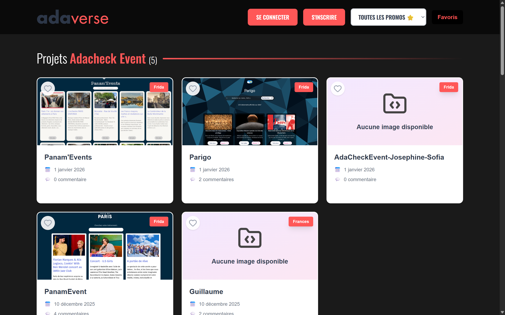
    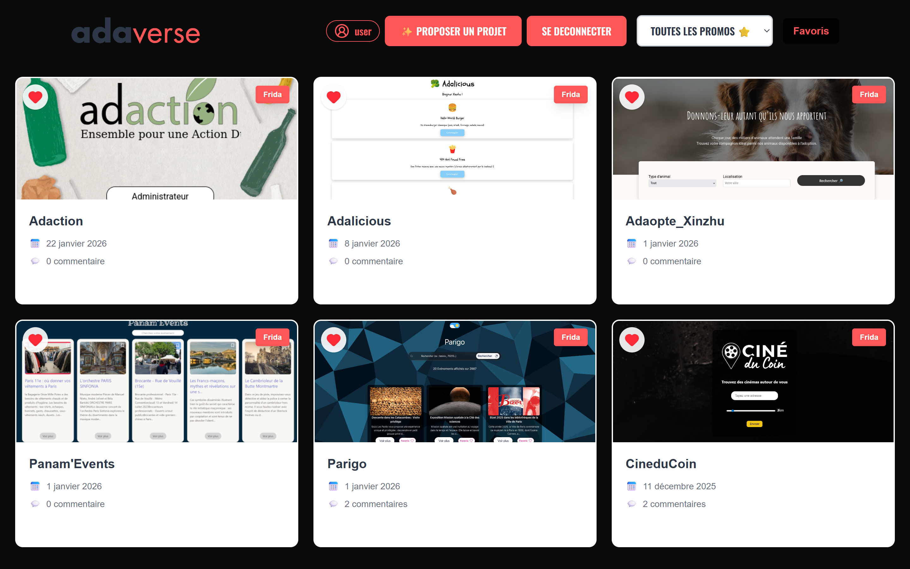
      
    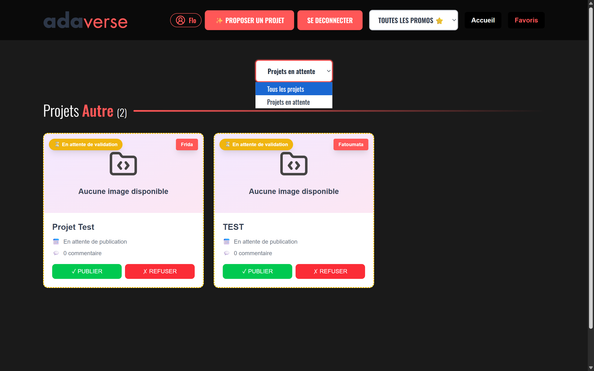
    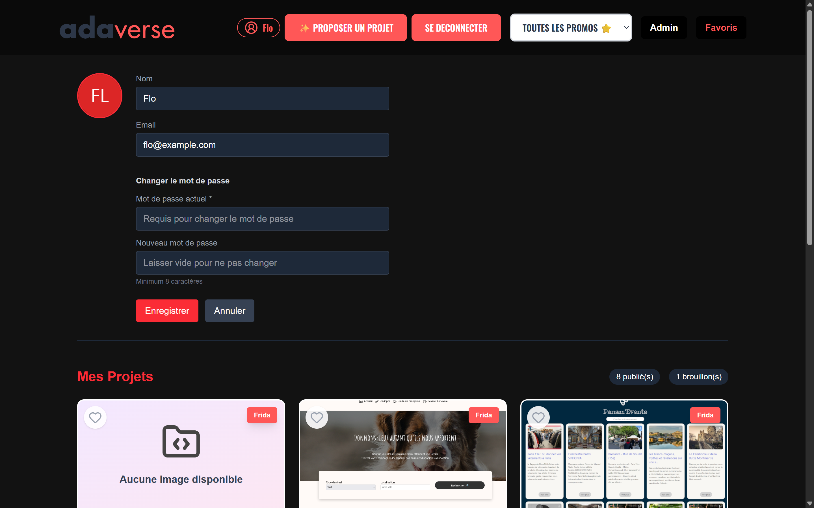
  

   

### ✨ Fonctionnalités principales

- Publication, consultation, commentaire et gestion de projets étudiants  
- Système d’authentification user/admin
- Gestion du profil (photo de profil, nom, email, mot de passe)
- Gestion des favoris  
- Filtrage des projets par promotion et par statut (publié / en attente côté admin)

### 🧩 Réalisations techniques

- Application full‑stack en **Next.js (App Router)** avec **Server Actions** pour sécuriser les opérations sensibles  
- Base de données **PostgreSQL** gérée avec **Drizzle ORM** (schémas typés, migrations, requêtes SQL type‑safe)  
- Système d’authentification complet avec gestion des rôles **user/admin** et sécurisation des routes  
- CRUD complet pour les projets : création, édition, suppression, statut publié/en attente  
- Gestion du profil utilisateur (informations + photo de profil)  
- Système de favoris lié à l’utilisateur  
- Filtrage des projets par promotion et par statut  
- Architecture modulaire et scalable combinant **Server Components** et **Client Components**

📅 **Durée :** 2 semaines
👥 **Équipe :** 4 personnes

- 🖥️ Démo : <https://adaverse-2-0.vercel.app>  
- 📦 Repo : <https://github.com/Niouk971/projet-collectif-adaverse-2.0>

### 🧰 Stack utilisée

  

    
    
    
    
    
    
    
  

---

  
<strong>🔹 Ada Check Event — Recensement d’événements publics à Paris</strong>

   

  <!-- Screenshots -->
  

    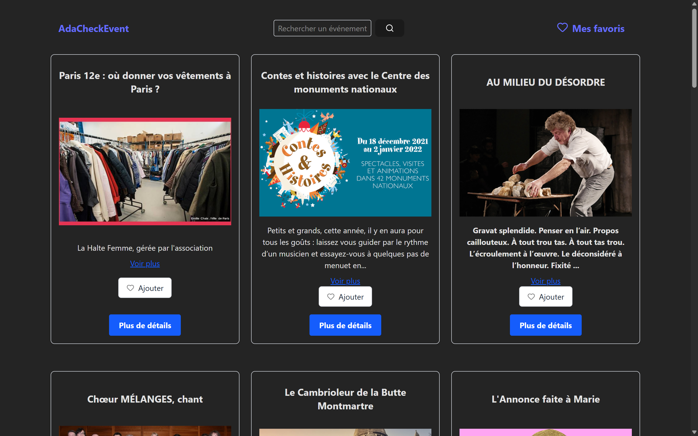
    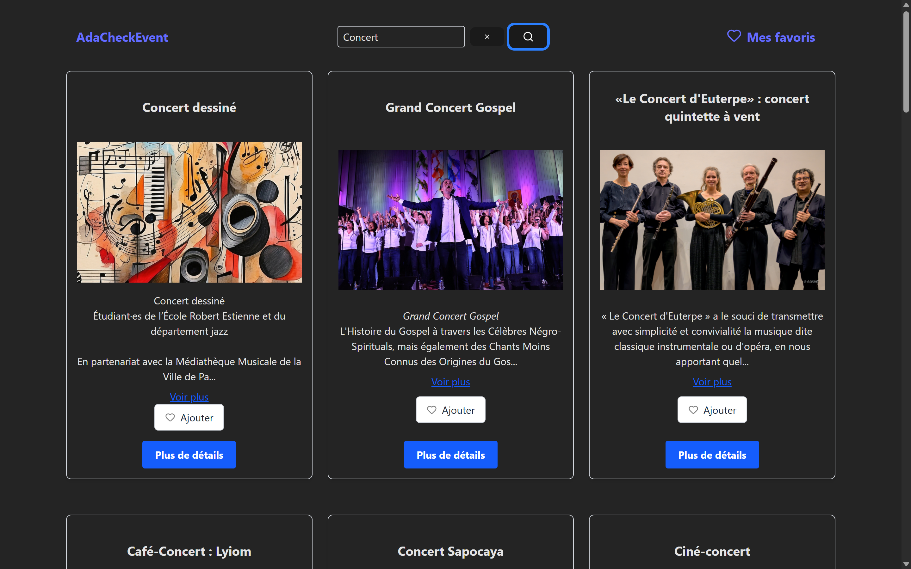
      
    
    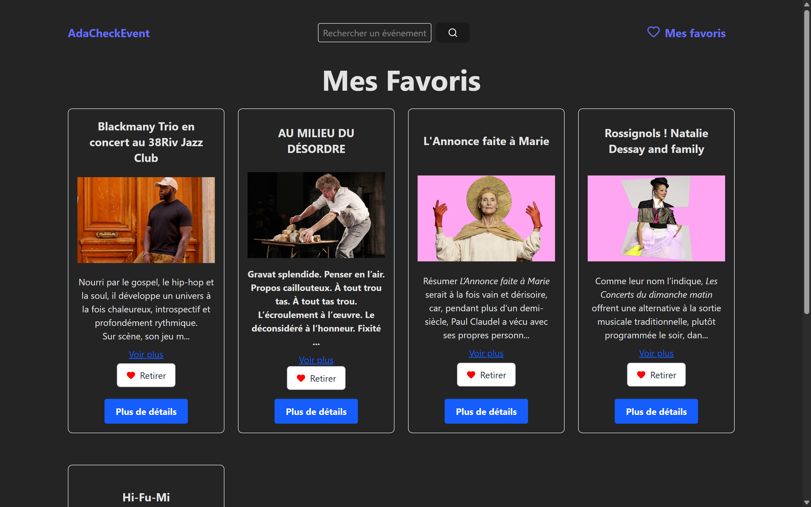
  

   

### ✨ Fonctionnalités principales

- Affichage des événements publics à Paris  
- Recherche d’événements via mots‑clés  
- Page de favoris pour sauvegarder des événements  
- Affichage détaillé d’un événement avec un bouton "voir plus" pour étendre la description

### 🧩 Réalisations techniques

- Appels API pour récupérer les événements publics et mise à jour de l’interface en temps réel  
- Gestion de l’état avec `useState` et déclenchement des appels API via `useEffect`  
- Affichage dynamique des résultats grâce à la méthode `.map()`  
- Mise en place d’un système de favoris persistant via le `localStorage`  
- Création d’un composant dédié pour l’extension/réduction de la description ("voir plus")  
- Filtrage des événements côté client en fonction des mots‑clés saisis  
- Architecture en composants réutilisables pour organiser la liste, les cartes d’événements et les favoris

📅 **Durée :** 2 semaines
👥 **Équipe :** 2 personnes

- 🖥️ Démo : <https://projet-collectif-ada-check-event.vercel.app/>
- 📦 Repo : <https://github.com/Niouk971/projet-collectif-ada-check-event>

### 🧰 Stack utilisée

  

    
    
    
    
  

---

  
<strong>🔹 AdAction — Site de gestion des collectes de déchets</strong>

   

  <!-- Screenshots -->
  

    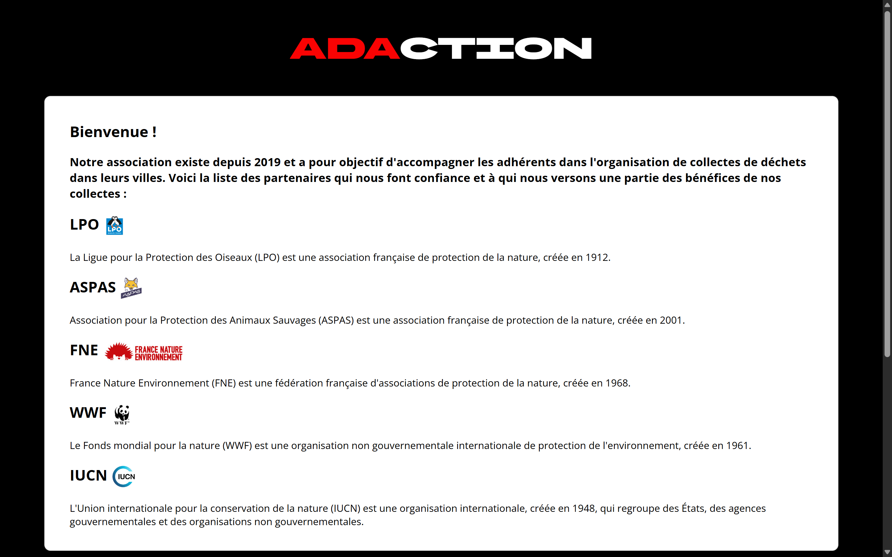
    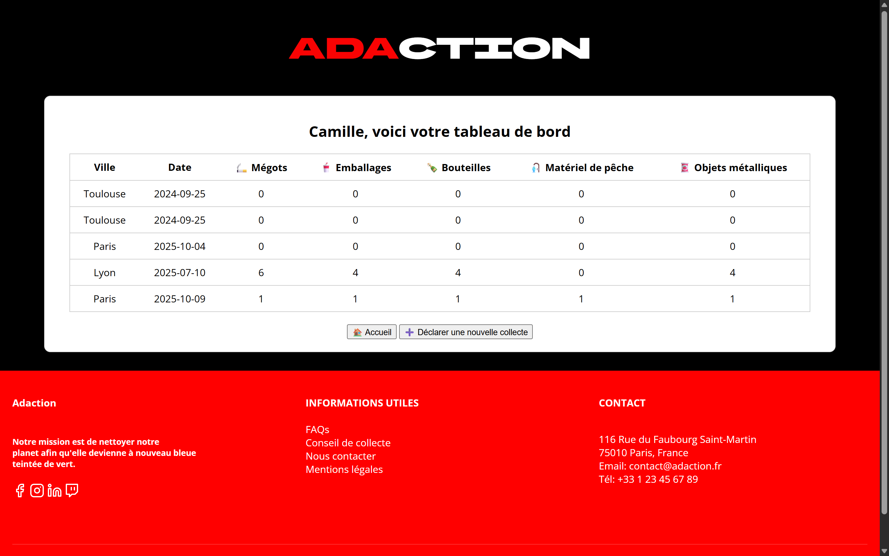
      
    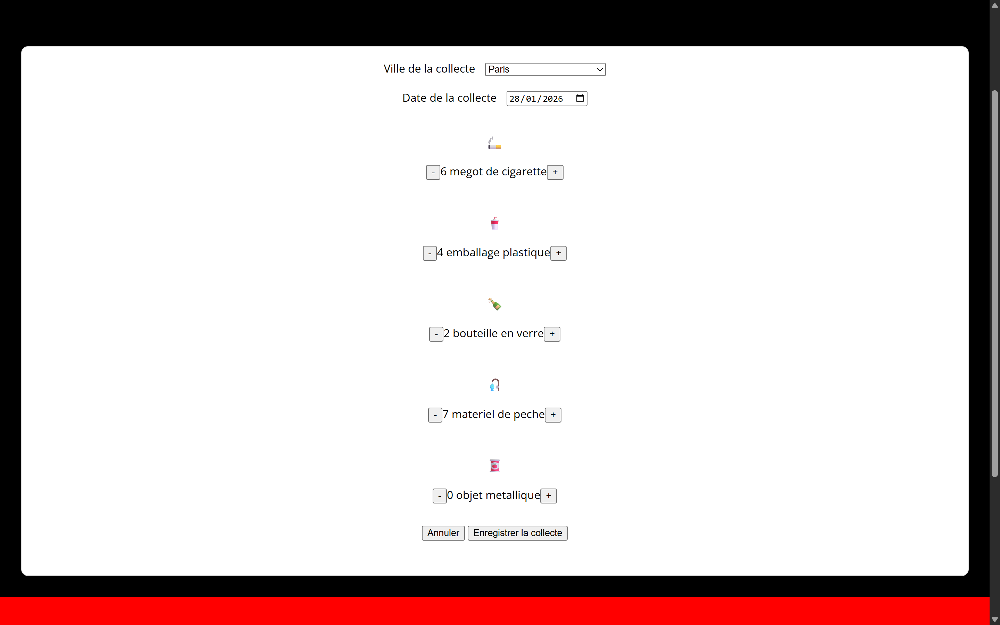
    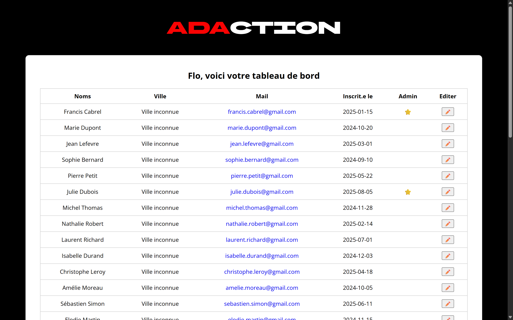
  

   

### ✨ Fonctionnalités principales

- Organisation de collectes de déchets dans différentes villes  
- Gestion des utilisateurs (user/admin) avec ajout de nouveaux comptes  
- Tableau de bord listant les collectes réalisées  
- Déclaration rapide d’une nouvelle collecte  

### 🧩 Réalisations techniques

- Conception du schéma de base de données et création d’une instance PostgreSQL sur **Neon**  
- Mise en place d’un **CRUD complet** pour les collectes et les utilisateurs (GET, POST, PUT, DELETE)  
- API construite avec **Express.js**, incluant des routes dédiées pour les collectes, l’authentification et la gestion des utilisateurs  
- Gestion des rôles (user/admin) avec sécurisation des endpoints sensibles  
- Validation des données côté serveur pour garantir l’intégrité des entrées  
- Architecture structurée en modules : routes, contrôleurs, services et accès à la base  
- Tests manuels des endpoints via Postman pour vérifier le bon fonctionnement de l’API

📅 **Durée :** 2 semaines
👥 **Équipe :** 3 personnes

- 🖥️ Démo : <https://projet-collectif-adaction.vercel.app/>
- 📦 Repo : <https://github.com/Niouk971/projet-collectif-adaction>

### 🧰 Stack utilisée

  

    
    
    
    
  

---

  
<strong>🔹 Adaopte — Site d’adoption d’animaux</strong>

   

  <!-- Screenshots -->
  

    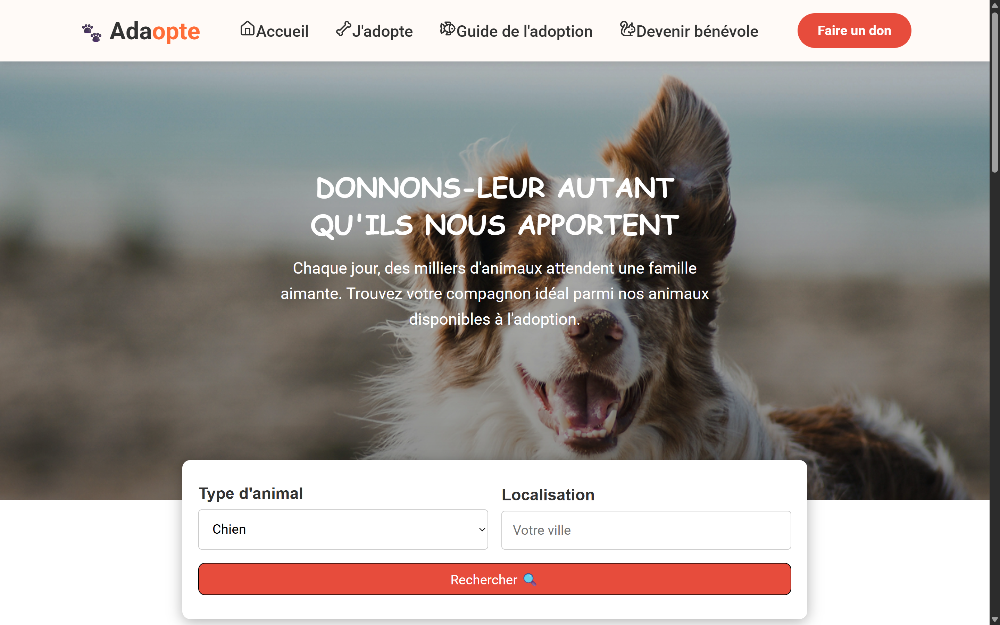
    
      
    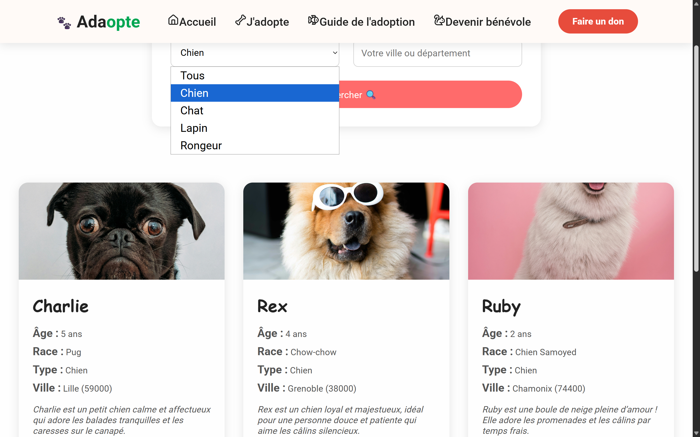
    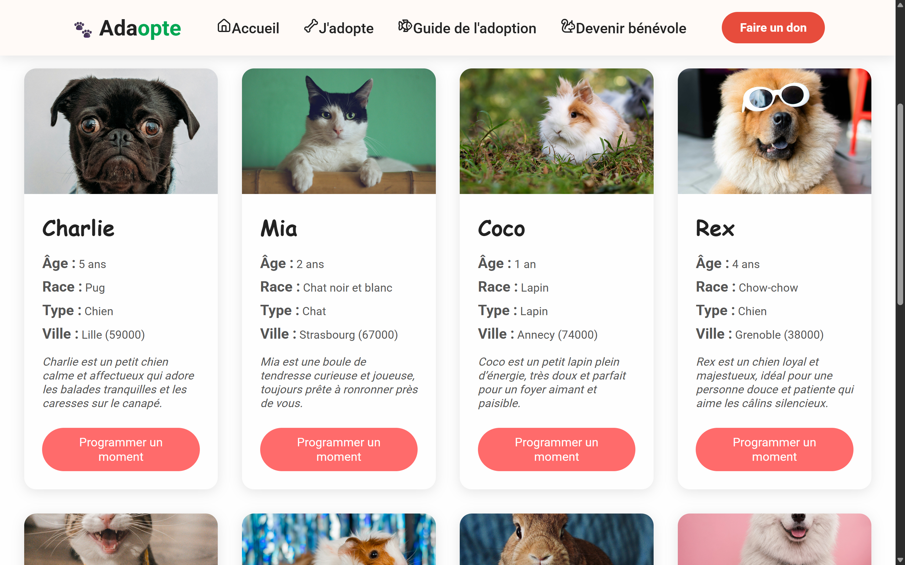
  

   

### ✨ Fonctionnalités principales

- Barre de navigation permettant de naviguer entre les différentes pages du site  
- Formulaire de recherche pour filtrer les animaux par type (chien, chat, lapin, rongeur) et par localisation (ville ou département)  
- Affichage dynamique des animaux sous forme de cartes  
- Footer contenant les informations essentielles du site  
- Menu burger pour la navigation mobile

### 🧩 Réalisations techniques

- Mise en place d’un menu burger responsive, avec ouverture/fermeture via JavaScript  
- Navigation multi‑pages (MPA) avec plusieurs fichiers HTML organisés dans des dossiers (`pages/`, `css/`, `data/`, `icons/`)  
- Accessibilité renforcée grâce aux attributs ARIA (`aria-label`) et à une structure sémantique propre  
- Création d’une grille responsive affichant les animaux, adaptée aux différentes tailles d’écran  
- Chargement des données depuis un fichier JSON (`animals.json`) et affichage dynamique via JavaScript  
- Filtrage des animaux selon les critères du formulaire (type + localisation)  
- Utilisation de `DOMContentLoaded`, `fetch()`, `async/await` et de la méthode `.map()` pour générer les cartes  
- Gestion des événements (`click`, `submit`) et prévention du rechargement de page avec `e.preventDefault()`

📅 **Durée :** 2 semaines
👥 **Équipe :** Projet individuel

- 🖥️ Démo : <https://projet-personnel-adaopte.vercel.app/>
- 📦 Repo : <https://github.com/Niouk971/projet-personnel-adaopte>

### 🧰 Stack utilisée

  

    
    
    
  

---

  
<strong>🔹 Dataviz — Visualisation de données</strong>

   

  <!-- Screenshots -->
  

    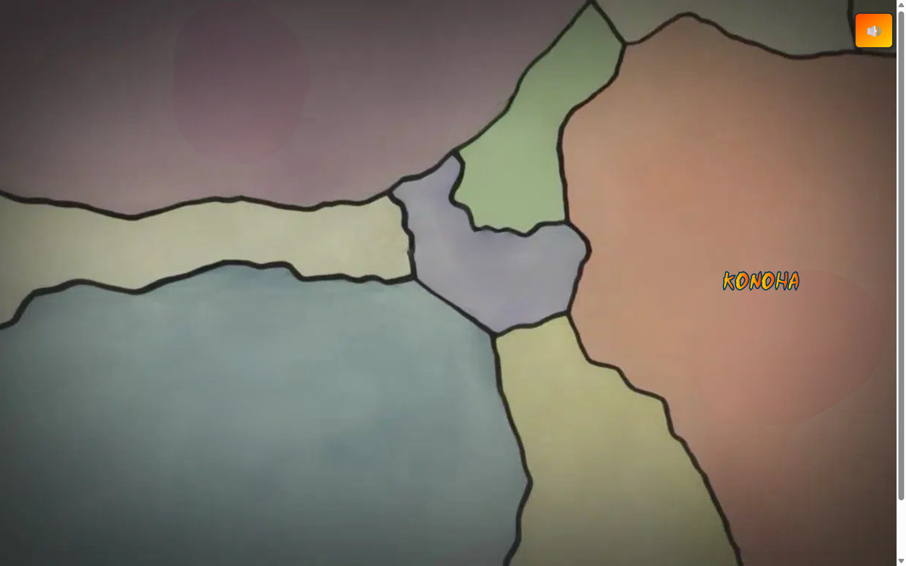
    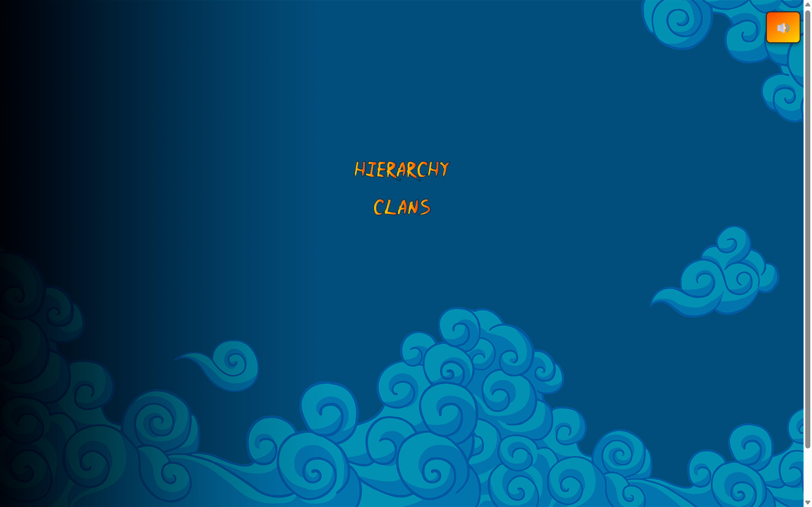
      
    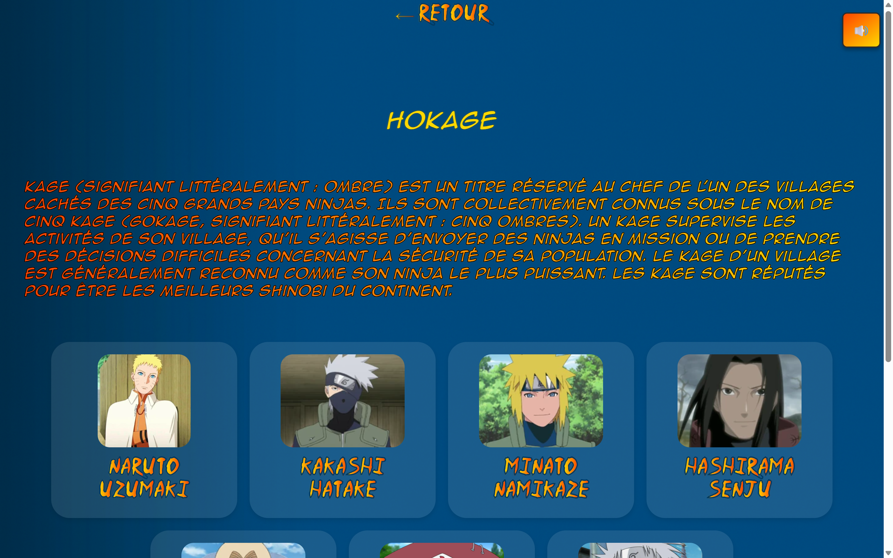
    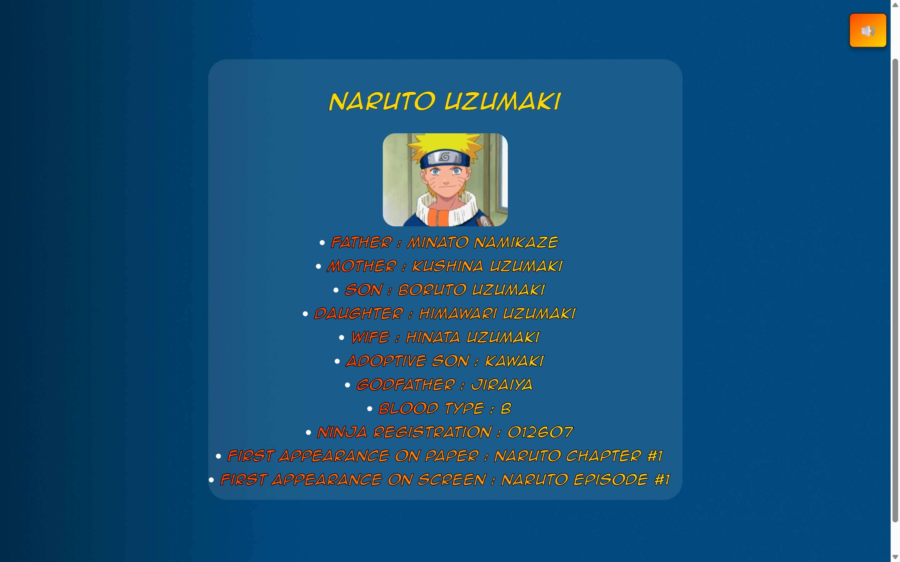
  

   

### ✨ Fonctionnalités principales

- Visualisation de données autour de l’univers du manga *Naruto*  
- Exploration du village caché de Konoha : hiérarchie (Kage, Anbu, Academy Student…) et clans emblématiques (Uzumaki, Uchiha, Hyuga…)  
- Description détaillée pour chaque hiérarchie et chaque clan  
- Affichage des personnages appartenant à chaque catégorie sous forme de cartes comprenant :  
  - photo  
  - nom et prénom  
- Page dédiée pour chaque personnage, incluant :  
  - membres de la famille  
  - groupe sanguin  
  - numéro d'immatriculation ninja  
  - première apparition dans le manga et dans l’anime  
- Intégration d’une ambiance sonore avec la musique de *Naruto*  

### 🧩 Réalisations techniques

- Utilisation d’une API Naruto pour récupérer dynamiquement les données (première utilisation d’une API dans un projet)  
- Requêtes `fetch()` avec gestion asynchrone (`async/await`) pour charger les informations des clans, hiérarchies et personnages  
- Génération dynamique du contenu : création des fiches, affichage conditionnel et mise en forme des données reçues  
- Construction d’une grille responsive pour afficher les cartes des personnages (photo + nom/prénom)  
- Organisation du projet en plusieurs pages pour structurer la navigation (hiérarchie, clans, personnages)  
- Manipulation du DOM pour injecter les données dans les sections correspondantes  
- Gestion des erreurs lors des appels API (`try/catch`)  
- Ajout d’une source audio intégrée au site pour renforcer l’immersion  

📅 **Durée :** 2 semaines
👥 **Équipe :** 3 personnes

- 🖥️ Démo : <https://projet-collectif-dataviz.vercel.app/>
- 📦 Repo : <https://github.com/Niouk971/projet-collectif-dataviz>

### 🧰 Stack utilisée

  

    
    
    
  

---

  
<strong>🔹 Quiz — Application de quiz interactive</strong>

   

  <!-- Screenshots -->
  

    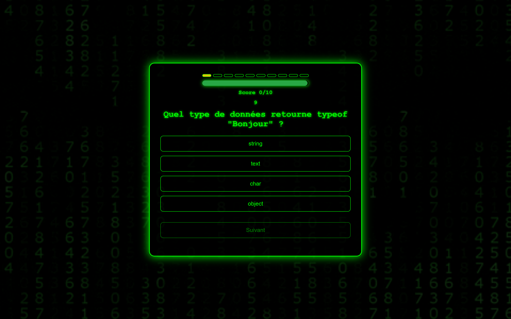
    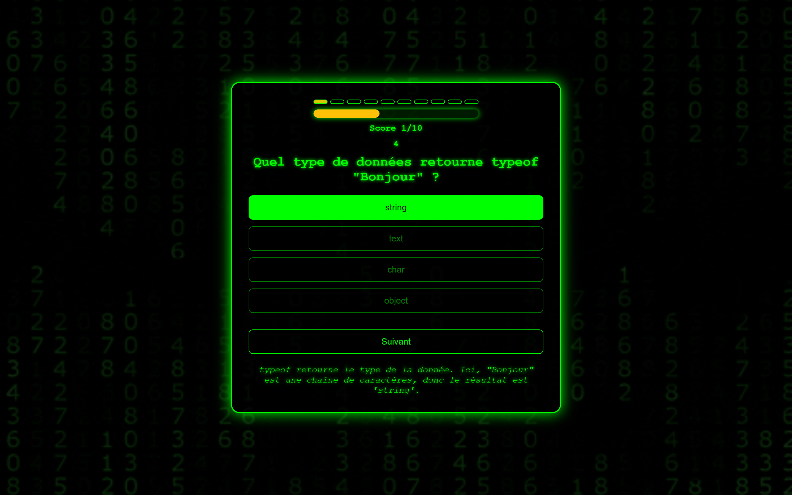
      
    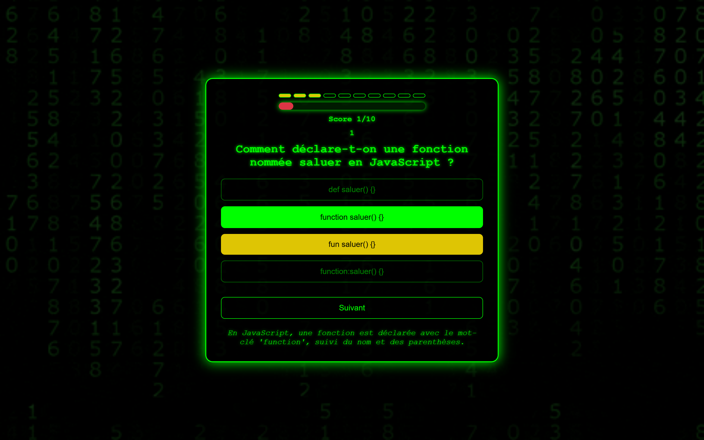
    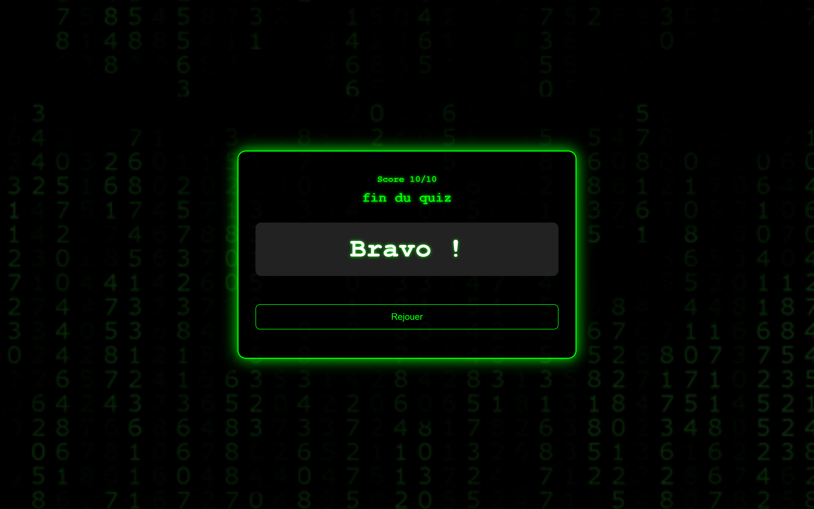
  

   

### ✨ Fonctionnalités principales

- Quiz sur le thème du code, avec un visuel inspiré de l’univers du film *Matrix*  
- Gestion du score et suivi de la progression des questions  
- Décompte en secondes pour répondre, avec affichage automatique de la correction à la fin du timer ou dès que le joueur répond  
- Code couleur pour indiquer la bonne ou la mauvaise réponse
- Message personnalisé en fin de quiz en fonction du score obtenu  

### 🧩 Réalisations techniques

- Manipulation du DOM pour afficher dynamiquement les questions, réponses, explications et messages de fin  
- Gestion du timer avec `setInterval()` pour synchroniser le décompte et la barre de progression du temps  
- Mise en place d’un système de score et de suivi de la progression via des variables d’état internes  
- Utilisation d’une structure de données (tableau d’objets) pour stocker les questions, réponses, explications et solutions  
- Application d’un code couleur dynamique pour indiquer la validité des réponses (classes CSS ajoutées/retirées en JavaScript)  
- Génération dynamique de la barre de progression des questions via une boucle créant des ``  
- Gestion des événements (`click`) pour les réponses, avec blocage des interactions après validation  
- Mise en place d’un système d’affichage conditionnel :  
  - explication affichée après réponse ou fin du timer  
  - message final personnalisé selon le score  
- Effets CSS (hover, transitions, ambiance Matrix) pour renforcer l’immersion visuelle  

📅 **Durée :** 2 semaines
👥 **Équipe :** 3 personnes

- 🖥️ Démo : <https://projet-collectif-quiz.vercel.app/>
- 📦 Repo : <https://github.com/Niouk971/projet-collectif-quiz>

### 🧰 Stack utilisée

  

    
    
    
  

<!-- markdownlint-enable MD033 -->

---

## 🎯 Ce que je recherche

Je suis à la recherche d’une **alternance** en tant que :

### 👉 Développeur Web / Full‑Stack JavaScript  

Ce que je peux apporter :

- de la rigueur  
- une vraie capacité à apprendre vite  
- une bonne compréhension des architectures modernes  
- un sens du détail et de la qualité  
- une motivation énorme et une vraie envie de progresser

---

## 🔗 Me retrouver

- 💼 LinkedIn : <https://www.linkedin.com/in/florian-polter-495370225/>  
- 🐙 GitHub : <https://github.com/Niouk971>  
- 🌐 Portfolio : *(à venir)*

---

## 📩 Contact

Si mon profil t’intéresse, n’hésite pas à me contacter :  
**→ florian (<florian.polter.77@gmail.com>)**

---

Merci d’avoir pris le temps de visiter mon profil 🙌
